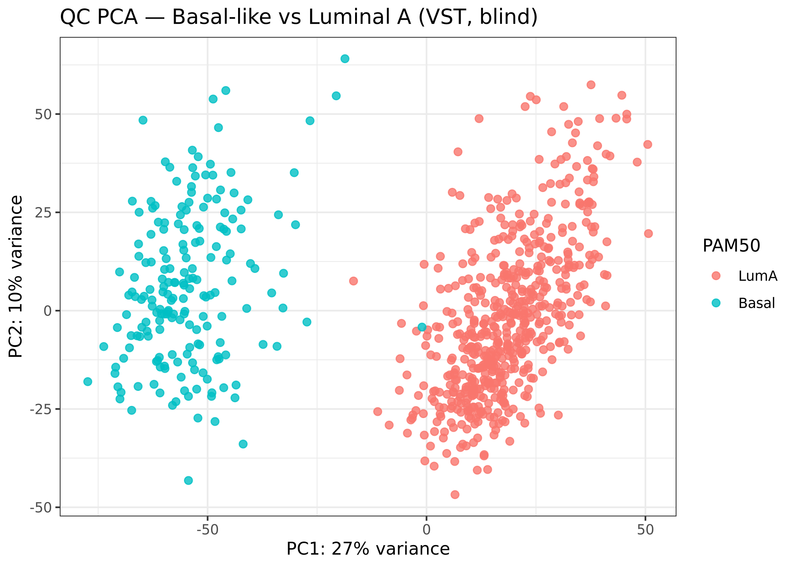
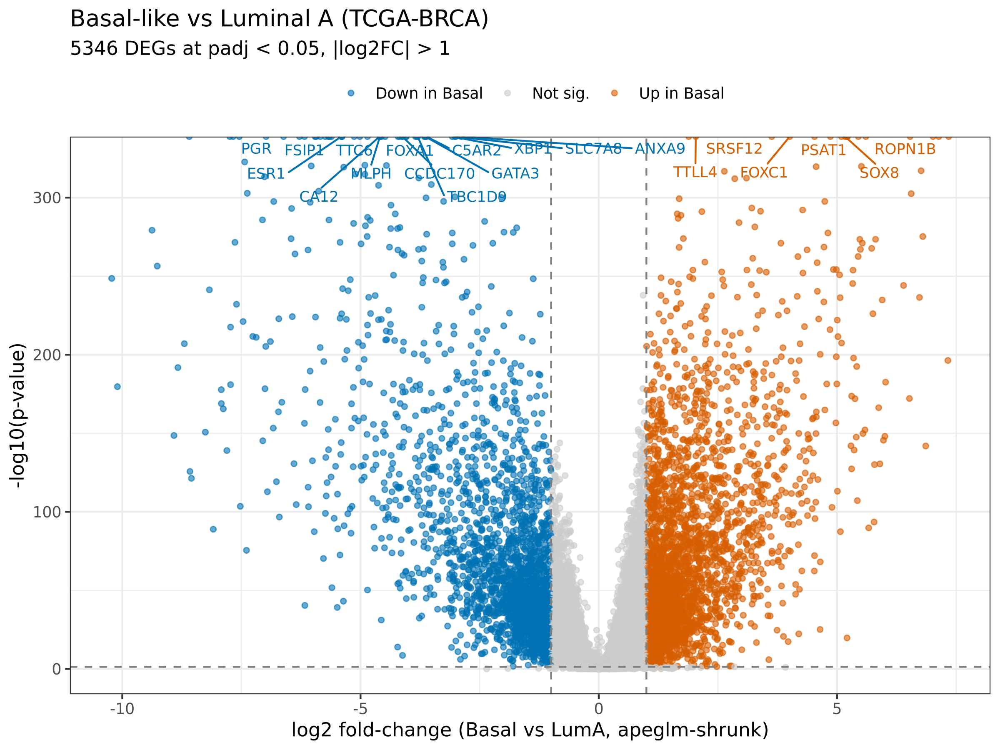
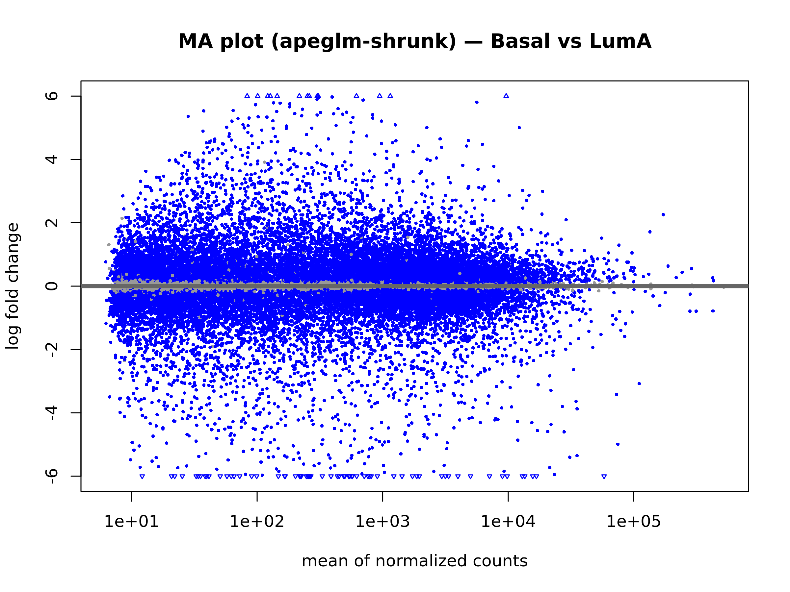
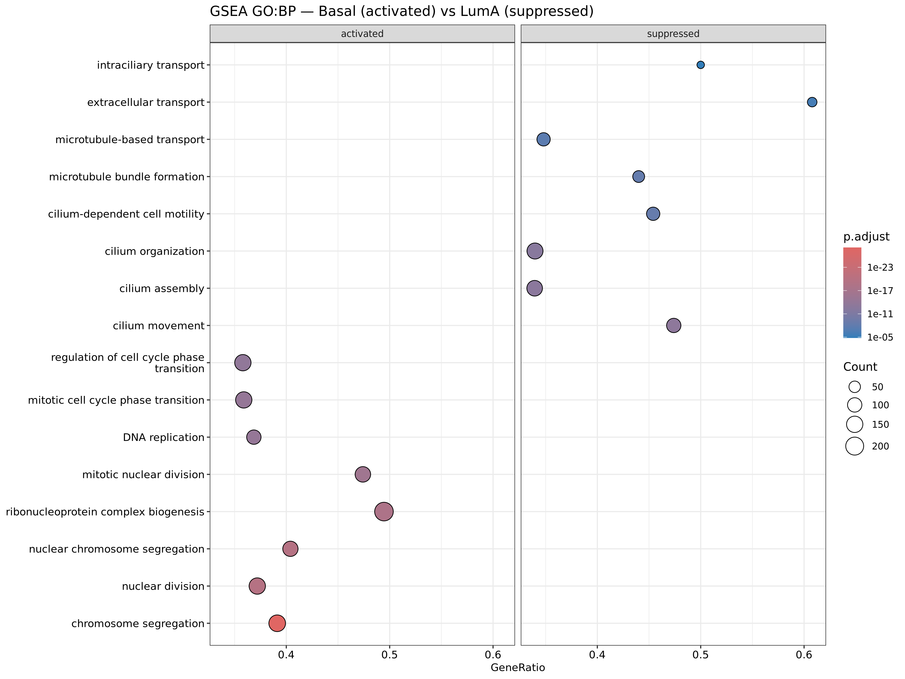
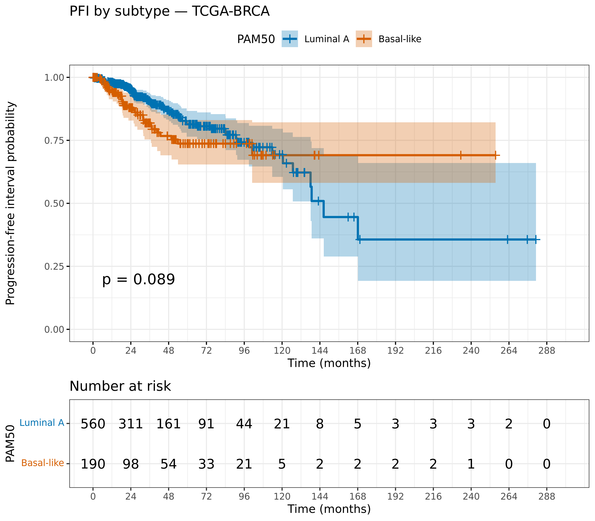
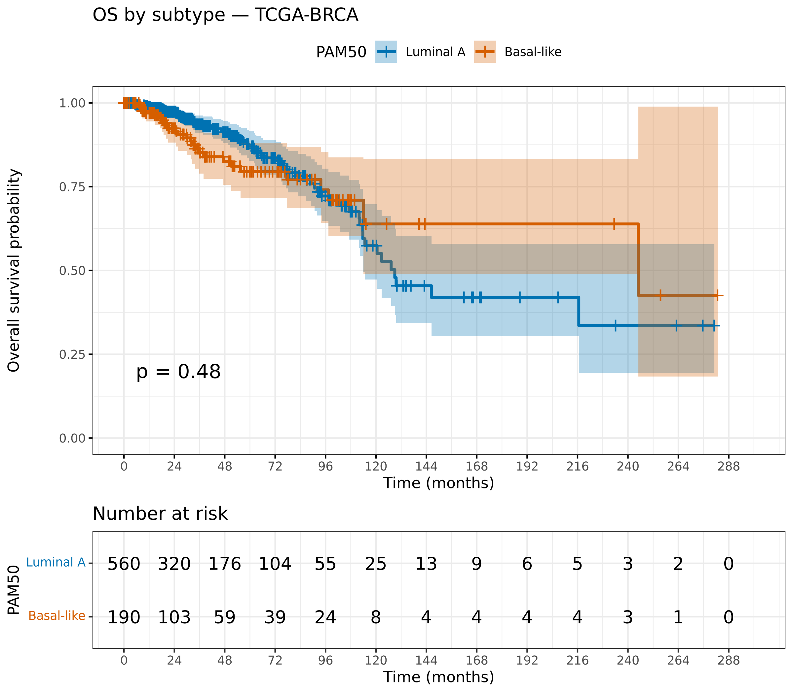

```{r setup}
#| include: false
# Every number in this report is read LIVE from the saved pipeline outputs, so
# it cannot drift from the analysis. Figures are the versions the scripts saved.
suppressPackageStartupMessages({
  library(here); library(dplyr); library(knitr)
  library(DESeq2); library(clusterProfiler); library(survival)
})

# --- Cohort & gene filter (from the analysis-ready dds) ---
dds            <- readRDS(here("data", "processed", "dds_basal_vs_luma.rds"))
n_samples      <- ncol(dds)
n_genes_filt   <- nrow(dds)
grp            <- table(dds$condition)          # LumA, Basal
n_luma         <- unname(grp["LumA"]); n_basal <- unname(grp["Basal"])

# --- Differential expression ---
PADJ <- 0.05; LFC <- 1
res_df <- readRDS(here("data", "processed", "deseq2_results_annotated.rds"))
n_tested <- nrow(res_df)
sig  <- !is.na(res_df$padj) & res_df$padj < PADJ & abs(res_df$log2FoldChange) > LFC
n_deg  <- sum(sig)
n_up   <- sum(sig & res_df$log2FoldChange > 0)
n_down <- sum(sig & res_df$log2FoldChange < 0)

# --- Enrichment (counts + top GSEA GO terms per direction) ---
enr <- readRDS(here("data", "processed", "enrichment_results.rds"))
n_terms <- function(x) if (!is.null(x)) nrow(as.data.frame(x)) else 0L
gg <- if (!is.null(enr$gsea_go)) as.data.frame(enr$gsea_go) else data.frame()
top_dir <- function(df, positive = TRUE, k = 5) {
  if (nrow(df) == 0) return(df)
  d <- df[if (positive) df$NES > 0 else df$NES < 0, , drop = FALSE]
  d <- d[order(d$p.adjust), c("Description", "NES", "p.adjust")]
  d$NES <- round(d$NES, 2); d$p.adjust <- signif(d$p.adjust, 2)
  head(d, k)
}
top_basal <- top_dir(gg, TRUE); top_luma <- top_dir(gg, FALSE)

# --- Survival (all values from the saved comparison) ---
sv <- readRDS(here("data", "processed", "survival_results.rds"))
subtype_cmp <- sv$subtype_cmp
endpoint_summary <- sv$endpoint_summary
row_of <- function(ep, md) subtype_cmp[subtype_cmp$endpoint == ep & subtype_cmp$model == md, ]
pfi_adj <- row_of("PFI", "Age-adjusted")
os_adj  <- row_of("OS",  "Age-adjusted")

sig_word <- function(p) ifelse(p < 0.05, "statistically significant",
                               "not statistically significant")
ph_word  <- function(p) ifelse(p < 0.05, "violated", "supported")
```

# Question

Basal-like and Luminal A are the two most transcriptionally divergent PAM50
breast-cancer subtypes. This report asks (1) which genes and pathways separate
them, and (2) whether subtype is associated with progression-free interval (PFI)
or overall survival (OS) in the TCGA-BRCA cohort.

# Data and methods

Open-access GDC **STAR - Counts** (GENCODE v36, GRCh38) were retrieved with
`TCGAbiolinks`; PAM50 labels from `TCGAquery_subtype`; and survival endpoints and
covariates from the TCGA Pan-Cancer Clinical Data Resource (Liu et al., 2018).
Differential expression used DESeq2 with apeglm shrinkage; enrichment used
clusterProfiler (GO/KEGG over-representation and GSEA); survival used
Kaplan-Meier, log-rank, and Cox regression. Full methods and exact versions are
in the repository scripts and `results/tables/*_session_info.txt`.

# Cohort and quality control

The analysis cohort is **`r n_samples` primary tumours** — `r n_basal`
Basal-like and `r n_luma` Luminal A — one sample per patient. A blind
variance-stabilised PCA separates the subtypes along PC1, confirming they are
globally distinct before any testing.

```{r fig-pca}
#| label: fig-pca
#| fig-cap: "QC PCA (blind VST): Basal-like and Luminal A separate on PC1."
#| echo: false

```

# Differential expression

Testing `r format(n_tested, big.mark = ",")` genes (Luminal A as reference),
DESeq2 identified **`r format(n_deg, big.mark = ",")` differentially expressed
genes** at padj < `r PADJ` and |log2FC| > `r LFC`: **`r format(n_up, big.mark = ",")`
up in Basal-like** and **`r format(n_down, big.mark = ",")` up in Luminal A**
(positive log2FC = higher in Basal-like).

Orientation was validated against canonical markers — luminal genes
(*ESR1, GATA3, FOXA1, PGR*) higher in Luminal A, basal markers (*FOXC1, SOX8*)
higher in Basal-like.

::: {.callout-note}
With `r n_basal` vs `r n_luma` samples, many genes reach very small p-values.
The results are therefore interpreted through effect sizes and concordance with
established markers, not p-values alone.
:::

```{r fig-volcano}
#| label: fig-volcano
#| fig-cap: "Volcano plot. Orange = up in Basal-like, blue = up in Luminal A."
#| echo: false

```

```{r fig-ma}
#| label: fig-ma
#| fig-cap: "MA plot (apeglm-shrunk): low-count fold-changes pulled toward zero."
#| echo: false

```

# Functional enrichment

Over-representation (on the DEGs) and GSEA (on the full ranked list) were run by
direction. GSEA on GO:BP returned `r n_terms(enr$gsea_go)` gene sets and on KEGG
`r n_terms(enr$gsea_kegg)`; the two methods are concordant. Top GSEA GO terms:

```{r tbl-gsea-basal}
#| echo: false
kable(top_basal, caption = "Top GSEA GO:BP terms enriched in Basal-like (NES > 0).",
      row.names = FALSE)
```

```{r tbl-gsea-luma}
#| echo: false
kable(top_luma, caption = "Top GSEA GO:BP terms enriched in Luminal A (NES < 0).",
      row.names = FALSE)
```

In summary, Basal-like tumours are enriched for cell-cycle / proliferation and
immune programs, and Luminal A tumours for hormone signalling and differentiated
(P450 / xenobiotic) metabolism.

```{r fig-gsea}
#| label: fig-gsea
#| fig-cap: "GSEA GO:BP — activated (Basal-like) vs suppressed (Luminal A)."
#| echo: false

```

# Survival

PFI (primary) and OS (secondary) were analysed identically. All values below are
read from the saved comparison table.

```{r tbl-survival}
#| echo: false
kable(subtype_cmp, caption = "Subtype (Basal vs Luminal A) effect across endpoints and models.",
      row.names = FALSE)
kable(endpoint_summary, caption = "Endpoint event counts and follow-up.",
      row.names = FALSE)
```

For PFI, the age-adjusted subtype hazard ratio is
**`r pfi_adj$HR` (95% CI `r pfi_adj$CI_low`–`r pfi_adj$CI_high`, p = `r pfi_adj$cox_p`)**,
which is **`r sig_word(pfi_adj$cox_p)`** (log-rank p = `r pfi_adj$logrank_p`). For
OS the age-adjusted HR is **`r os_adj$HR` (95% CI `r os_adj$CI_low`–`r os_adj$CI_high`,
p = `r os_adj$cox_p`)**, also **`r sig_word(os_adj$cox_p)`**.

::: {.callout-important}
Neither endpoint reached statistical significance. Both hazard ratios point
above 1 (higher event hazard in Basal-like), but every confidence interval
crosses 1. This is a **non-significant trend, not a demonstrated survival
difference**, and a non-significant result does not prove the absence of one.
:::

The Kaplan-Meier curves **cross** for both endpoints — Basal-like has more early
events, Luminal A more late events. This corresponds to the proportional-hazards
assumption being **`r ph_word(pfi_adj$PH_global_p)`** for PFI (global p =
`r pfi_adj$PH_global_p`), which means the single Cox HR and the log-rank test —
both time-averaged — only approximately summarise a time-varying difference.
Late-time separation rests on very few patients at risk and should not be
over-interpreted.

```{r fig-km}
#| label: fig-km-pfi
#| fig-cap: "PFI by subtype. Curves cross (non-proportional hazards)."
#| echo: false

```

```{r fig-km-os}
#| label: fig-km-os
#| fig-cap: "OS by subtype (secondary endpoint)."
#| echo: false

```

# Limitations

Survival associations are non-significant trends limited by crossing hazards and
few late events. The analysis inherits the GDC's fixed alignment/annotation (a
deliberate choice for a downstream-focused study) and is not validated in an
external cohort.

# Reproducibility

```{r session}
#| echo: false
cat("Rendered:", format(Sys.time(), "%Y-%m-%d %H:%M"), "\n")
cat("Per-stage package versions: results/tables/*_session_info.txt\n")
```
